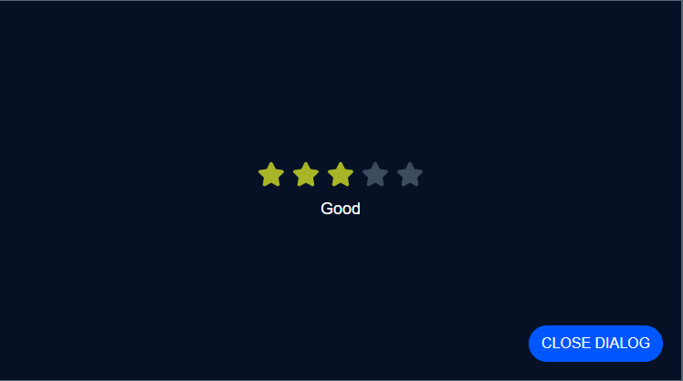

# Rating System

## Description

This project is a React application that allows users to rate a service using a five-star rating system. The application uses React functional components, props, conditional rendering, and the useState hook.

## Features

* Five clickable stars
* Dynamic star colors based on rating
* Rating message that changes based on the selected number of stars
* Dialog box with a close button
* State management using useState
* Props used for communication between components

## Technologies Used

* React
* JavaScript
* CSS
* React Icons

## Components

### StarRating

Displays five stars and manages the rating state.

### Star

Represents a single star and calls a function passed from the parent component when clicked.

### Dialog

Displays a message and includes a button to close the dialog.

## Git Repository

https://tracy-boateng.github.io/rating-system/

## Author

Tracy Boateng
